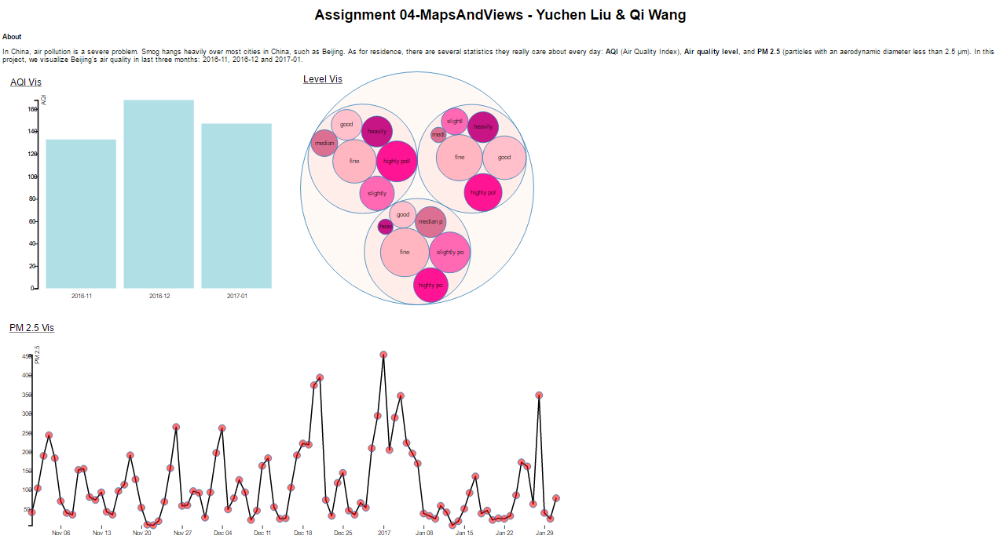
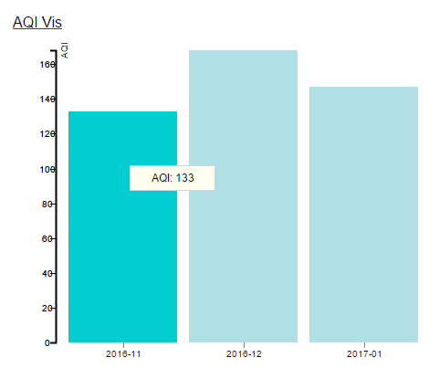
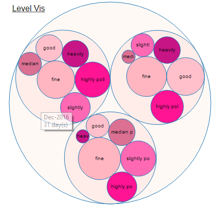
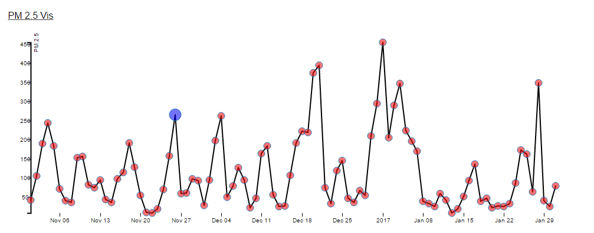
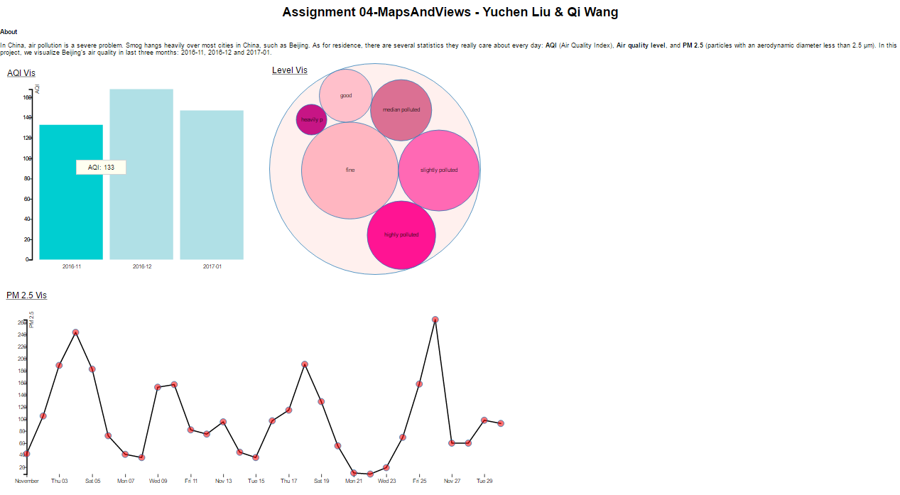
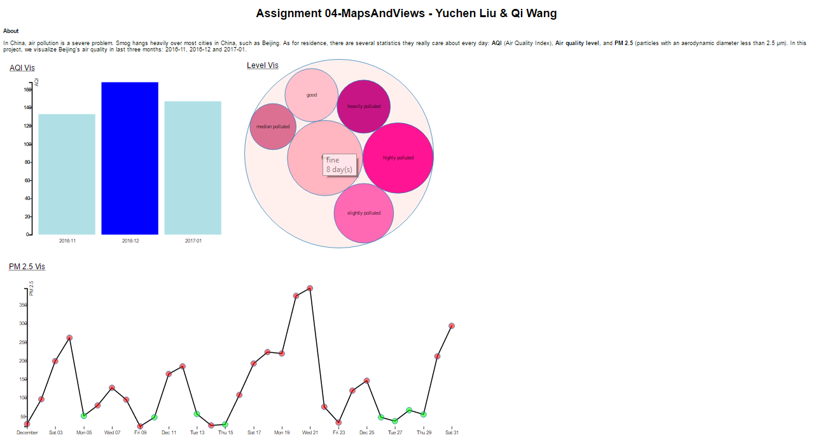
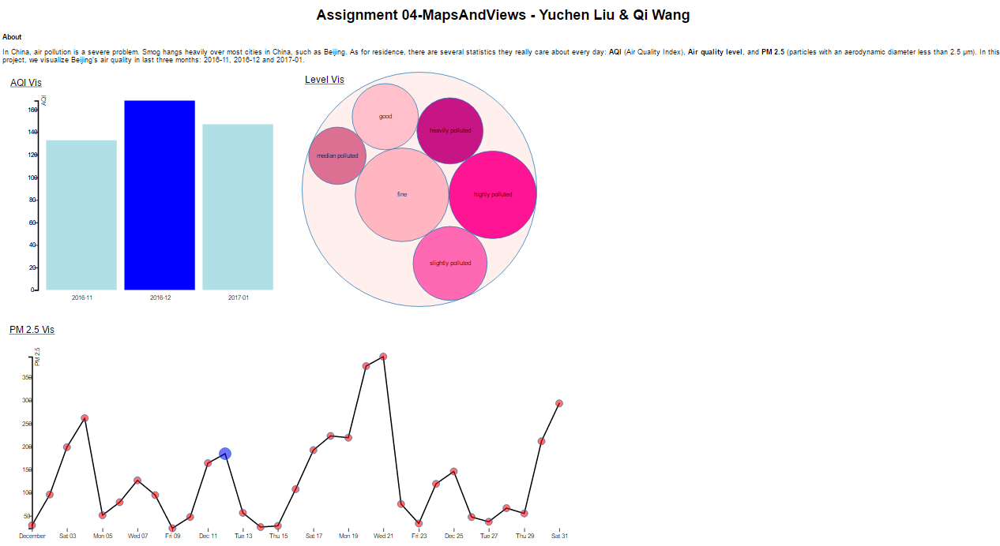

# Assignment 4 - Visualizations and Multiple Views  

##Working Link
link: https://qiwang19.github.io/04-MapsAndViews/index.html   
  
## About
In China, air pollution is a severe problem. Smog hangs heavily over most cities in China, such as Beijing. As for residence, there are several statistics they really care about every day: AQI (Air Quality Index), air quality level, and PM 2.5 (particles with an aerodynamic diameter less than 2.5 μm). In this project, we visualize Beijing’s air quality in last three months: 2016-11, 2016-12 and 2017-01.  

##General View  

First bar chart visualize the average AQI (can indicate the air quality for a specific month) for each month.  

  
Second circle packing visualize the number of days in different air quality level for each month, the size of circle is mapped to the number of day.  
 
  
Third line chart visualize the PM 2.5 for each day in each month.  

  
##Interaction
Bar chart: User can see AQI for each month by moving mouse on the corresponding bar. User can choose a specific month by clicking the corresponding bar. After clicking it, the circle pack and line chart will display the statistics in that month. User can go back to the general view by clicking that bar again or choosing another bar to see a different month’s statistics.   
  
  
Circle packing: User can mouse over the circle to see the month and its corresponding information. For example, “Good 8 days” or “Dec-2016 31 days”. In the general view, user can click the circle to zoom into a specific month, the line chart will also zoom into that month, and the corresponding bar in the bar chart will be marked in dark blue. If user mouse over the circle for air quality level (good, fine, etc.), the date (indicated by dot in line chart) in that air quality level will be marked in green in line chart. After that, user can go back to general view by clicking the circle for that month again.  
  
  
Line chart: User can click the dot (date) on the line chart to zoom into the corresponding month, the circle packing will also change to that month and  the corresponding bar will be marked with dark blue. After that, user can click any dot to go back to the general view and perform other operations.  
  
  
##Technical achievement 
Learn how to visualize the information in different views.  
  
Learn all to draw some new kinds of chart in D3, for example, circle packing.   
  
Learn how to add interactions between different views. In this project, we try different way to add interactions: for some interactions, we use D3 “.on” functions, for other interactions, we use “dispatch”.   
  
##Design achievement
Choosing different charts according to different attributes we want to visualize. Instead of using the pie chart, using the proportion of the surface covered by the circles in circle pack to visualize the air level.  
  
The line chart is better to show the change of PM2.5 during a long time than other two charts.  
  
We carefully choose the color, for example, in the line chart, the original dot is red, and the date for a specific level is marked in green, we utilized the contrasting color. Also we used order and category color map in the circle pack. The number of colors is smaller than 12. It is effective because only around 12 bins of color can be distinguished in the human view.  
